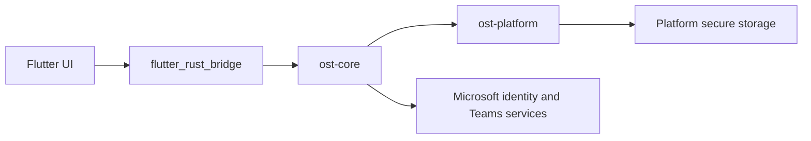

# Microslop architecture

## Application boundary

The application uses a native Flutter shell and Rust via `flutter_rust_bridge`. Tauri is not part of this application.

## Authentication

`ost-core` implements the work/school device-code grant using the `organizations` authority. It requests the Teams scope and `offline_access`, then exchanges the Microsoft access token at the existing OST Teams auth service.

Flutter receives `verificationUri`, `userCode`, expiry, and sign-in state. It never receives Microsoft access tokens, refresh tokens, Skype tokens, or IC3 tokens.

`ost-platform` stores the refresh token through the operating system credential store. Windows uses Credential Manager through the Rust `keyring` crate, Apple and Linux use their platform credential stores, and Android initializes the native keyring from the application context. Teams, Skype, Graph, and IC3 access tokens remain in Rust memory and are refreshed from the stored Microsoft refresh token.

## Current scope

The Flutter client supports work/school device-code login, joined teams and channels, chats, message history, text/image/file sending, reactions, read receipts, local encrypted message caching, notifications, and live chat updates. Rust owns Microsoft and Teams requests and credential handling; Flutter receives display data rather than bearer credentials.

Live chat updates use a persistent Teams Trouter WebSocket owned by `ost-core`. It authenticates and registers the client, acknowledges incoming deliveries, and sends changed conversation identifiers to Flutter. Flutter reconciles the affected conversation from Teams. Reconnects and Trouter message-loss signals trigger reconciliation rather than relying on polling alone.

Calling is split between the Flutter call UI, `app/rust`, and the shared `src/calling` protocol/media implementation. The application bridge handles outgoing and incoming one-to-one calls, SDP/ICE/SRTP media, microphone and speaker control, H.264 video, and incoming call notifications. Android supplies native camera capture, audio routing, and the embedded remote-video surface. Linux also builds the Rust V4L2/SDL2 media implementation, although remote video is not embedded in the Flutter desktop surface.

Incoming video calls currently negotiate caller video as receive-only, so accepting a video call does not silently enable the local camera. TURN relay support and full ICE role-conflict handling remain incomplete, and a real-person incoming Teams video call still needs production end-to-end validation.

## Source provenance

This repository starts from OST at commit `089214470ce0cea1c30d57ede54da07121ef71ec`. The original project is MIT licensed. Retain its licence and attribution for all OST-derived protocol code.

## Known constraints

OST is an unofficial Teams client. Microsoft can change its authentication, signaling, and Teams service behaviour without notice. Calling therefore keeps protocol/media regressions covered by local tests and the Microsoft Test Call harness, while platform-specific claims still require live validation on that platform.